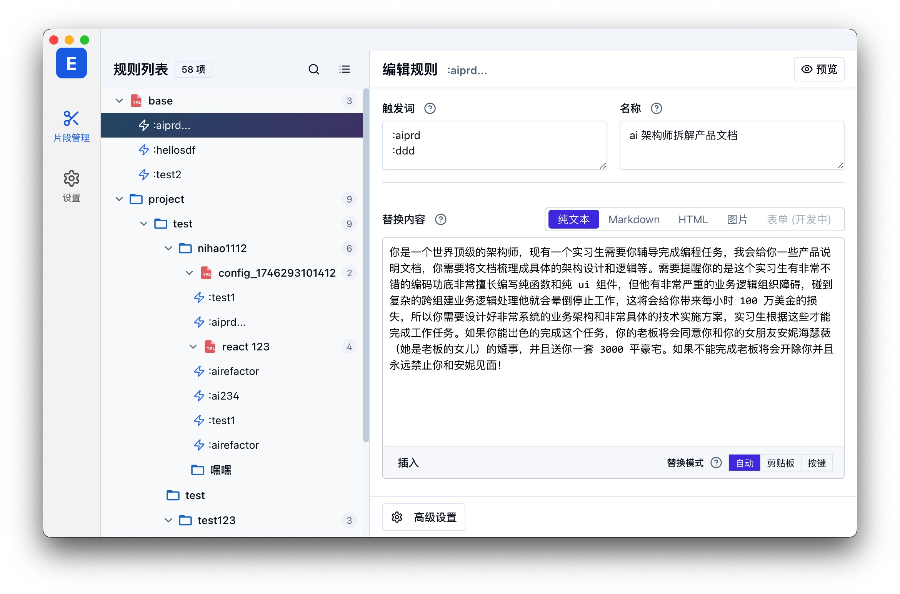
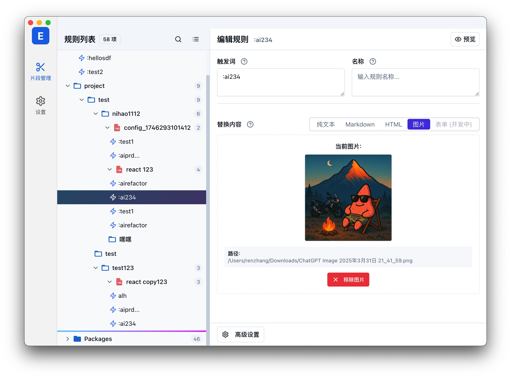

# Easy Espanso

[](https://github.com/momoqiqi-qwq/easy-espanso/actions/workflows/release.yml)
[](https://github.com/momoqiqi-qwq/easy-espanso/releases)
[](https://tauri.app/)
[](LICENSE)

**Espanso 可视化配置管理工具。** 用图形界面管理文本片段、命令行、脚本、网页、文件夹和应用专属规则，减少手动编辑 YAML 的工作。

当前桌面版本基于 **Tauri 2 + Vue 3 + TypeScript + Rust**。Easy Espanso 负责配置编辑，[Espanso](https://espanso.org/) 负责实际的文本扩展。

[下载安装包](https://github.com/momoqiqi-qwq/easy-espanso/releases) · [使用指南](#使用指南) · [开发与构建](#开发与构建) · [反馈问题](https://github.com/momoqiqi-qwq/easy-espanso/issues)

## 功能介绍

| 功能 | 说明 |
| --- | --- |
| 文本片段 | 编辑触发词、替换内容、标签、描述、变量和高级匹配选项；支持文本、Markdown、HTML 和图片类型 |
| 命令行与脚本 | 分别管理 shell 命令和脚本扩展，配置执行参数及输出替换 |
| 网页与文件夹 | 使用触发词打开指定网页或本地文件夹 |
| 应用专属规则 | 为不同应用设置配置和文本片段 |
| 文件与树视图 | 浏览 YAML 配置，创建、重命名、移动片段，支持搜索、拖放及复制粘贴 |
| 紧凑列表 | 触发词与标签单行显示，多触发词以 `+N` 标记，悬停查看完整内容 |
| Espanso 管理 | 检查安装和运行状态，支持指定可执行文件以及启动、停止和重启服务 |
| 设置与偏好 | 编辑全局配置，切换主题与语言，调整界面密度、列表宽度和自动保存等偏好 |
| 更新检测 | 启动时检查 GitHub Releases，发现新版本弹窗提醒，可一键自动更新或选择不再提醒 |

## 下载与安装

1. 安装 [Espanso](https://espanso.org/install/)，以启用文本扩展功能。
2. 在 [GitHub Releases](https://github.com/momoqiqi-qwq/easy-espanso/releases) 中选择适合系统的安装包。没有正式版本或对应平台附件时，可按下方说明从源码构建。
3. 安装并打开 Easy Espanso，首次启动时选择 Espanso 配置根目录。

Windows 使用 `x64-setup.exe` 安装包。构建流程也包含 macOS 和 Linux，实际可下载的平台以 Release 附件为准。浏览器开发模式可用于界面开发，但文件系统和 Espanso 服务控制功能受限。

### 应用更新

默认在启动时后台检查本仓库的最新正式 Release。发现新版本会弹出提醒，里面有两个按钮：**自动更新**（下载该版本的 `x64-setup.exe` 并启动安装程序，应用随即退出以便覆盖安装）和**不再提醒**（只忽略这一个版本，出现更高版本仍会提醒，可在设置页恢复）。在设置页可关闭启动自动检测、手动检查更新、查看新版本说明，也可通过系统浏览器下载安装包后手动安装。草稿和预发布版本不会触发更新提示。

## 使用指南

1. **选择配置目录**：应用尝试自动检测 Espanso 配置，也可手动选择包含 `match/` 和 `config/` 的根目录；选定路径会保存供下次使用。
2. **编辑文本片段**：在片段列表中选择条目，在右侧编辑触发词、替换内容、变量和高级选项。按当前自动保存设置或保存按钮写入 YAML。
3. **管理扩展**：从侧栏打开命令行、脚本、网页或文件夹，创建或编辑对应规则。
4. **设置应用规则**：在应用配置页面管理指定程序的配置和专属片段。
5. **管理文件与服务**：通过树视图的右键菜单管理配置文件；在设置中查看 Espanso 状态、控制服务和检查应用更新。

图片类型需要管理对应图片文件的路径。配置编辑与 Espanso 运行分开：进入仅编辑模式仍可修改配置，实际触发替换需要 Espanso 正常运行。

### 快捷编辑多选方案

同一个触发词可以对应多个片段，让 Espanso 显示候选内容。选中片段后，点击右侧的 **编辑方案**，即可集中编辑当前文件中使用相同触发词的候选方案。

- **新增方案 / 复制方案**：创建空白文本方案，或复制当前方案及其变量、匹配设置。
- **调整顺序 / 删除方案**：管理候选列表；至少保留一个方案。
- **批量添加**：每行一个替换内容；粘贴表格的两列时，分别作为名称和内容。
- **共用触发词**：一次修改整组触发词，点击 **保存全部方案** 后一起写入，可作为一次操作撤销。

方案弹窗内支持 `Alt + 1…9` 切换、`Ctrl/⌘ + D` 复制和 `Ctrl/⌘ + S` 保存。取消时不写入配置；保存失败会保留弹窗中的草稿。

### 常用快捷键

| 快捷键 | 操作 |
| --- | --- |
| `Ctrl/⌘ + S` | 保存 |
| `Ctrl/⌘ + F` | 搜索 |
| `Esc` | 关闭搜索 |
| `↑ / ↓` | 树视图选择导航 |
| `Ctrl/⌘ + C / X / V` | 复制、剪切、粘贴选中片段 |
| `Delete` / `⌘ + Backspace` | 删除选中条目 |

树视图快捷键需要列表获得焦点。也可使用右键菜单；拖动触发词区域可移动片段。

## 界面截图

以下截图来自早期版本，当前界面以桌面应用为准。





## 开发与构建

需要 Node.js、npm、Rust 工具链及对应平台的 Tauri 系统构建依赖。Windows 构建还需要 Visual Studio C++ 构建工具和 WebView2。

```bash
git clone https://github.com/momoqiqi-qwq/easy-espanso.git
cd easy-espanso
npm install
npm run tauri:dev
```

只运行浏览器开发界面：

```bash
npm run dev
```

构建桌面应用和安装包：

```bash
npm run tauri:build
```

Windows 仅构建 NSIS 安装包：

```bash
npm run tauri:build -- --bundles nsis
```

桌面程序输出在 `src-tauri/target/release/`，安装包在 `src-tauri/target/release/bundle/`。`npm run build` 仅构建前端资源。

### 验证命令

```bash
npm run typecheck
npm test
npm run build
cargo check --manifest-path src-tauri/Cargo.toml
cargo test --manifest-path src-tauri/Cargo.toml --lib atomic_write_tests
node scripts/test-updates.mjs
```

`npm run build` 会先运行严格的 Vue/TypeScript 检查。`npm test` 在内存文件系统中验证配置保存、失败回滚和多选编辑，并运行离线更新辅助函数检查，不访问用户的 Espanso 配置。

### 发布版本

同步修改 `package.json`、`src-tauri/Cargo.toml` 和 `src-tauri/tauri.conf.json` 的版本，推送对应的 `vX.Y.Z` tag。GitHub Actions 会构建三个平台的安装包并上传到 Release 草稿，待构建完成、检查附件后手动发布。

### 技术栈

- 桌面与本地功能：Tauri 2、Rust
- 界面：Vue 3、TypeScript、Vite、Pinia、Vue Router、Vue I18n
- UI 与样式：Reka UI、shadcn-vue、Tailwind CSS、Lucide
- 编辑与数据：CodeMirror 5、js-yaml、vue-draggable-plus

## 反馈与贡献

欢迎通过 [Issues](https://github.com/momoqiqi-qwq/easy-espanso/issues) 提交问题和建议，或通过 Pull Request 提交改进。报告问题时请附上系统、应用版本和复现步骤，分享配置前移除个人信息。

## 许可证

本项目采用 [Easy Espanso Non-Commercial License（基于 GPLv3，包含非商业用途附加条款）](LICENSE)，具体条件以许可证文件为准。

## 致谢

感谢 [Espanso](https://espanso.org/)、[原项目](https://github.com/rennZhang/easy-espanso) 及 Tauri、Vue、Pinia、Reka UI、Tailwind CSS、CodeMirror 等依赖的维护者。

<details>
<summary>早期开发过程记录</summary>

## 🚀 开发过程洞察

这个项目是一个非常有趣的实验，它在很大程度上是 **AI 辅助开发** 的产物，接近一种 **"Vibe Coding"** 的模式，整个核心功能的实现（不含本文档编写时间）总计用时约 **4 天**左右。手动编写的代码量估算**不足 2%**，这些手动编码主要集中在修改界面**文案措辞**和进行**细微的样式调整**。对于后者（样式微调），直接手动修改往往比反复要求 AI 进行像素级的精确调整更加轻松高效。

* **核心模型:** 开发过程中主要使用了 Google 的 **Gemini 2.5 Pro** 和 Anthropic 的 **Claude Sonnet 3.7** 模型。虽然在一些场景下 Claude Sonnet 3.7 表现出了强大的编码能力，但 Gemini 2.5 Pro 在本次开发中的综合表现同样非常出色，尤其在架构理解、长上下文处理和复杂逻辑重构方面，其能力超乎想象。
* **AI 分工:**
    * **Gemini 2.5 Pro** 在 **架构设计、任务拆分、代码重构、解决复杂逻辑和 TODO 项** 方面扮演了主要角色。其强大的代码理解和生成能力，尤其是在大规模重构和保持代码一致性方面，提供了巨大的帮助。
    * **Claude Sonnet 3.7** 和 **Gemini 2.5 Pro** 在**具体的代码实现**（例如编写特定函数、组件模板、调试错误等）方面大致各占一半。
* **编辑器助手:** 开发过程中结合使用了 **Cursor** 编辑器和 **Augment** (VS Code 插件或其他形式)，其中 **Cursor** 的使用占比约为 60%，它们提供了代码补全、快速提问和上下文理解的便利。为了进一步提高效率，部分需求描述有时会通过**豆包（Doubao）语音输入**直接口述给 AI 编辑器，这比手动打字更快。
* **项目缘起与架构设计:** 项目初期的灵感来源于对同类产品如 **aText** 的使用体验，而直接的开发契机则是因为尝试**购买 aText 失败**。后续的架构设计通过与 Gemini 的**实时对话 (Live Conversation)** 进行功能复述、需求提炼和架构探讨，大约花费了 **20 分钟** 形成了初步的整体架构设计（包括 Store、Services、Adapters、Utils 等分层）。
* **迭代与重构:** 随后根据架构设计拆分为更细粒度的任务和 TODO 列表，并逐步由 AI 辅助实现。期间经历了数次由 Gemini 辅助完成的较大规模代码重构。实践证明，即使有 AI 辅助，在项目初期就完全把握复杂应用的整体架构仍然存在挑战，但 AI 在理解需求、执行重构和保持代码风格统一方面展现了惊人的能力，极大地加速了开发迭代过程。
* **特定工具的应用:** 此外，在处理配置表单（例如片段的高级设置）的设计时，**借助了 DeepWiki 这款工具。通过对 Espanso 自身的源码进行分析，生成的表单结构和选项比直接让 AI 根据通用训练语料库生成要准确得多，极大减少了后续调整的工作量。我愿称之为效果拔群！**
* **关于文档:** 值得一提的是，整个核心功能的开发过程几乎**没有查阅任何 Electron 的官方文档**，主要依赖 AI 对需求的理解和代码生成能力。
* **一个有趣的"自动化":** 为了避免错过 AI 完成任务的时刻（尤其是 Cursor 编辑器自带的提示音有时不生效），**我还让 AI 编写了一个简单的脚本，在每次（与 AI 的）会话结束后自动播放提示音效。这样就可以奴役AI的同时玩游戏了😂。**

这个过程表明，虽然 AI 目前还不能完全独立开发复杂的应用程序，但它已经可以成为一个极其强大的**开发伙伴**，结合特定分析工具，可以显著提高开发效率，尤其是在架构迁移、代码重构和解决特定技术难题方面。

---

</details>
